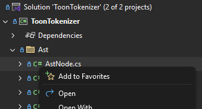

[marketplace]: https://marketplace.visualstudio.com/items?itemName=MadsKristensen.SolutionFavorites
[vsixgallery]: http://vsixgallery.com/extension/SolutionFavorites.9f81ec6e-5c91-4809-9dde-9b3166c327fd/
[repo]: https://github.com/madskristensen/SolutionFavorites

# Solution Favorites for Visual Studio

Download this extension from the [Visual Studio Marketplace][marketplace]
or get the [CI build][vsixgallery].

----------------------------------------

Pin your frequently used files to a **Favorites** node in Solution Explorer for quick access.

## Features

### Add Files to Favorites

Right-click any file in Solution Explorer and select **Add to Favorites** to pin it.

### Quick Access

All your favorite files appear under a **Favorites** node at the top of Solution Explorer. Double-click to open any file instantly.

### Context Menu Actions

Right-click any favorite file to access additional actions:

- **Remove from Favorites** - Unpin the file
- **Open Containing Folder** - Open the file location in Windows Explorer
- **Copy Full Path** - Copy the file path to clipboard

### Per-Solution Storage

Favorites are stored per solution in the `.vs` folder, so each solution maintains its own set of favorites.

## How can I help?

If you enjoy using the extension, please give it a ★★★★★ rating on the [Visual Studio Marketplace][marketplace].

Found a bug or have a feature idea? Head over to the [GitHub repo][repo] to open an issue.

Pull requests are enthusiastically welcomed!

If you find this extension saves you time, please consider [sponsoring me on GitHub](https://github.com/sponsors/madskristensen).